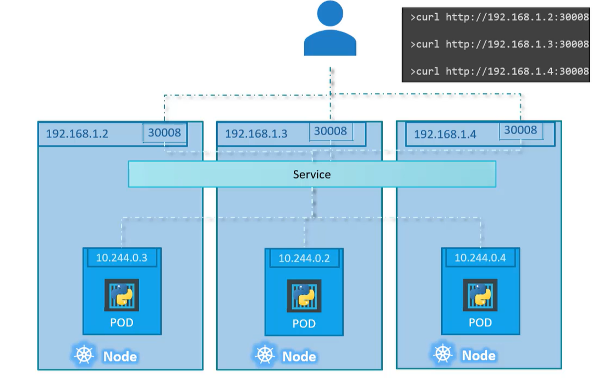
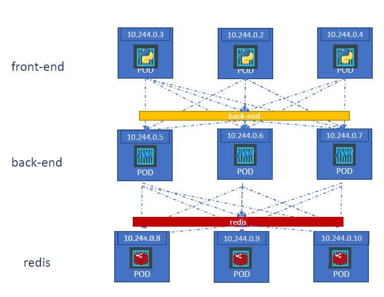

# Service

- A service allow communication between two or more pods.
- Service enable external access to the kubernetes pods. Services has many types
  - NodePort Service ( service listen on a particular port of a node and forward the request to the pod in kubernetes)
  - ClusterIP
  - Load Balancer

## NodePort
this service listens for requests on a specific port of a node and forward the request to the pod. Scope of this service is to allow access to cluster port i.e. <NodeIP>:<NodePort>

> A service is a like a virtual server inside the node, it has it own IP address and port. The IP is called `Cluster IP` of the service 

A service definition file looks like 
```yaml
apiVersion: v1
kind: Service
metadata:
 name: myapp-service
spec:
 type: NodePort
 ports:
  - targetPort: 80 # port of the Pod where request will land eventually
    port: 80  # port of the service
    nodePort: 30008 # port on the node that allow us to access the node externally
 selector:
  app: myapp
  type: front-end
```

- `port` field is mandatory
- Value for `nodePort` range varies between 30000 to 32767, you can provide one or k8s will automatically assign a random available port within range
- If you don't provide any value for the `targetPort`, k8s will use the value of `port` by default 
- `ports` section allow us to map multiple ports since it is an array.
- `selector` will allow us to map the service to an actual Pod running inside k8s

- If you have multiple pods within the same node that have the same labels set in the `selector` of service, k8s will create the service that will allow to access to different number of pods without any extra setup/configuration. The load balancing will be done using algorith random.

- If you have multiple pods that reside in different nodes that have the same labels set as `selector` in service and expose the same port , and you create a `nodePort` service, then 
  - k8s will span the service across all nodes 
  - `targetPort` will map to the same `nodePort` on all the nodes in the cluster
  - You can access the relevant pod using the IP of node plus the node port as shown in diagram below





## ClusterIP
You can have multiple set of pods running inside a cluster for example a set of front end , backend and cache stores. Each set need to communicate to another set
  - Front end to backend
  - Backend to cache
  - Backend to database

  > How can we establish the communication between different set of pods inside the cluster without relying on the IP addresses of the Pods as they can change whenever a Pod is removed or created again ?

We can create a set of services that will allow us to have a single interface to allow communication between a set of services



How to create a cluster ip service? 

A service definition file looks like 
```yaml
apiVersion: v1
kind: Service
metadata:
 name: back-end
spec:
 type: ClusterIP
 ports:
  - targetPort: 80 # port of the Pod where request will land eventually
    port: 80  # port of the service
 selector:
  app: myapp
  type: front-end
```


## LoadBalancer 
 This allow to provision a load balancer in supported cloud providers. Hence enabling to distribute the load across multiple nodes. For example load balancing to a set of front end server.


# Ingress

## Scenario
Let say we want to deploy a web app that will connect to database using a service. We want to access the application using `www.onlinestore.com`, we can expose the app using `nodePort` service and access the app using `www.onlinestore.com:node-port`. 

### Deployment on local data center
If we want to further make it simpler for user to access the website without adding the port while accesing the application, we can add a porxy server between our DNS server and the kubernetes cluster. The DNS server will forward the request to our proxy server (default port 80) and proxy server will forward it to the k8s on that specific port. This is how it is done we are deploying it on our data center

### Deployment on a could provider
When we have the same scenario as mentioned above but instead of deploying it locally, we are using a cloud provider for example GCP. When we configure the application everything will be the same except the kubernetes will request GCP to provision a load balancer that will route traffic from DNS server to the load balancer and this will then forward it to the k8s.

Now if we want to introduce another service let's say `www.onlinestore.com/watch` and make the older application accesible using `www.onlinestore.com/wear`, we now have 2 set of applications deployed on same k8s cluster, each has it's own node port service to access, now how we can configure in cloud. 
 - Every service will have a different load balancer
 - In order to route to different services, there will be another load balancer on top of it. (not a very efficient solution)
    - This will over complicate the setup
    - Where you will setup the SSL
    - Everytime you configure a new service you have make changes in load balancer as well

We can all of it using `Ingress` a kuberntes object that will allow to expose multiple services, load balancing, routing and other stuff. The ingress still need to be exposed as a Node port service or a load balancer in cloud environment.

Without ingress we can do it using a reverse proxy or load balancing solution like nginx, HAProxy or traefik. We have to configure URL routes, configuring SSL certificates and other configuration.

> Ingress is implemented by Kubernetes in kind of the same way, first deploy the supported solution and provide the configuration (a set of rules). The solution is deploy is called `Ingress Controller`. And the set of rules are called `Ingress Resources`. 

*By default k8s does not have an ingress controller, you have to install it manually*